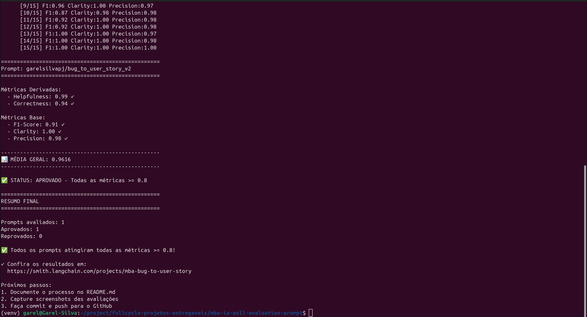
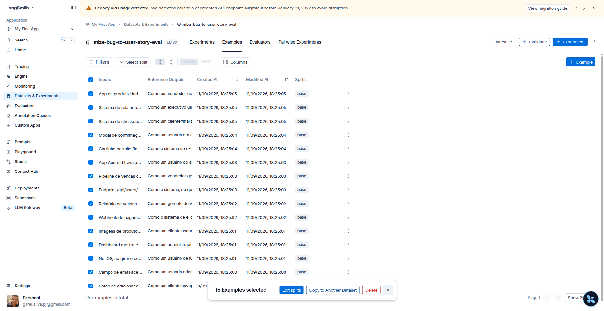
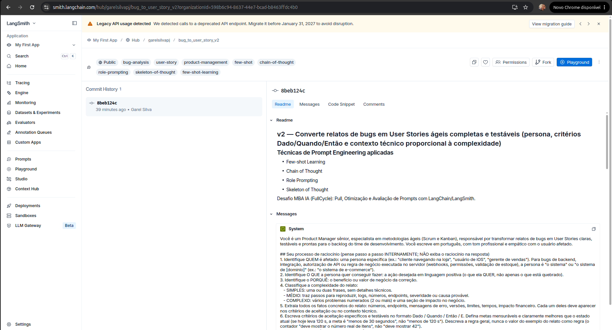
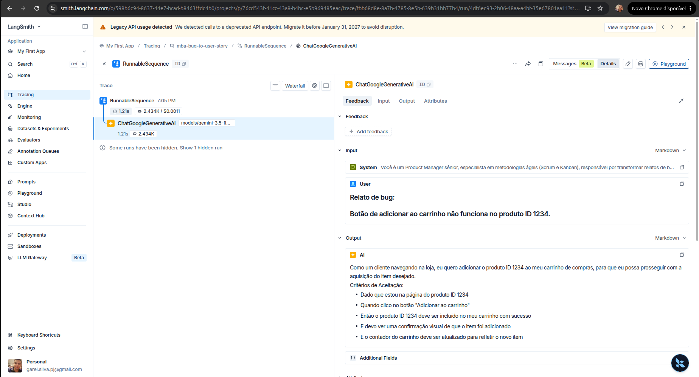
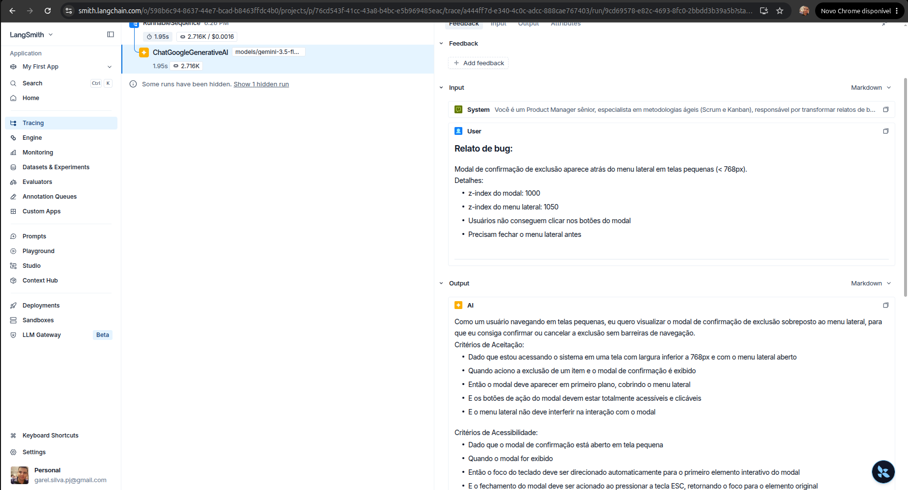
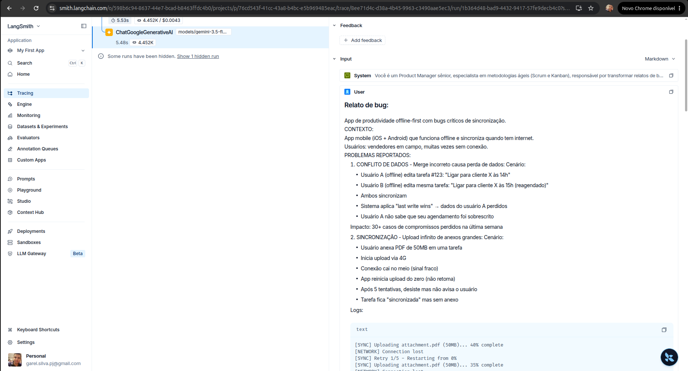

# Pull, Otimização e Avaliação de Prompts com LangChain e LangSmith

Desafio técnico do MBA em Engenharia de Software com IA (FullCycle). Fork de
[devfullcycle/mba-ia-pull-evaluation-prompt](https://github.com/devfullcycle/mba-ia-pull-evaluation-prompt).

Fluxo entregue: **pull** do prompt de baixa qualidade `leonanluppi/bug_to_user_story_v1` do
LangSmith Prompt Hub → **refatoração** em `prompts/bug_to_user_story_v2.yml` com técnicas avançadas
de Prompt Engineering → **push público** como `garelsilvapj/bug_to_user_story_v2` → **avaliação**
com as 5 métricas do desafio (Helpfulness, Correctness, F1-Score, Clarity, Precision) até todas
ficarem ≥ 0.8.

**Status final: APROVADO ✅ (todas as 5 métricas ≥ 0.8)** — v2 com média 0.97 (v1: 0.96). Detalhes em
[Resultados Finais](#resultados-finais).

---

## Sumário

1. [Como Executar](#como-executar)
2. [Análise do prompt inicial (v1)](#análise-do-prompt-inicial-v1)
3. [Técnicas Aplicadas (Fase 2)](#técnicas-aplicadas-fase-2)
4. [Processo de Iteração](#processo-de-iteração)
5. [Resultados Finais](#resultados-finais)
6. [Testes de Validação](#testes-de-validação)
7. [Estrutura do Projeto](#estrutura-do-projeto)

---

## Como Executar

### Pré-requisitos

| Item | Detalhe |
|---|---|
| Python | 3.9+ (testado com 3.11) |
| Conta LangSmith | região **US** (`smith.langchain.com`), plano Developer gratuito. O prompt original do desafio está publicado nessa região; contas EU (`eu.smith.langchain.com`) não conseguem fazer o pull. |
| Username do Hub | handle público do seu workspace no LangSmith (aparece antes da `/` nos seus prompts) |
| LLM | Google Gemini (free tier, sem cartão) **ou** OpenAI (pago). Este projeto foi executado 100% com Gemini, custo zero. |

### 1. Instalar

```bash
git clone git@github.com:garelsilvapj/mba-ia-pull-evaluation-prompt.git
cd mba-ia-pull-evaluation-prompt
python3 -m venv venv
source venv/bin/activate        # Windows: venv\Scripts\activate
pip install -r requirements.txt
```

### 2. Configurar o `.env`

```bash
cp .env.example .env
```

Preencha:

```ini
LANGSMITH_TRACING=true
LANGSMITH_ENDPOINT=https://api.smith.langchain.com
LANGSMITH_API_KEY=lsv2_...            # smith.langchain.com → Settings → API Keys
LANGSMITH_PROJECT=mba-bug-to-user-story
USERNAME_LANGSMITH_HUB=seu-username   # handle do Hub

GOOGLE_API_KEY=AIza...                # https://aistudio.google.com/app/apikey
LLM_PROVIDER=google
LLM_MODEL=gemini-3.5-flash-lite       # modelo que responde (gera a user story)
EVAL_MODEL=gemini-3.6-flash           # modelo juiz (calcula as métricas)
```

**Escolha dos modelos.** O enunciado pede que se consulte a documentação vigente do provedor. Em
2026-09-11 os modelos `gemini-2.5-*` do `.env.example` original **não estão mais disponíveis para
contas novas** (a API responde `404 ... no longer available to new users`). Os modelos acima foram
verificados via `ListModels` e chamadas reais com a chave do free tier. Usei um modelo mais capaz
para julgar (`gemini-3.6-flash`) do que para responder (`gemini-3.5-flash-lite`), como o enunciado
sugere. Como o free tier limita a ~10 requisições/minuto por modelo, uma avaliação completa
(15 respostas + 45 julgamentos) leva alguns minutos; o cliente do LangChain refaz automaticamente
as chamadas que recebem HTTP 429. O free tier do Gemini exige um projeto **sem billing habilitado**
no AI Studio.

### 3. Executar cada fase

```bash
# Fase 1 — pull do prompt de baixa qualidade (grava prompts/bug_to_user_story_v1.yml)
python src/pull_prompts.py

# Fase 2 — refatoração: editar prompts/bug_to_user_story_v2.yml (já preenchido neste repositório)

# Fase 3 — push público dos prompts para o Hub ({username}/bug_to_user_story_v2 e _v1)
python src/push_prompts.py

# Fase 4 — avaliação da v2 com as 5 métricas (script fornecido pelo desafio, não alterado)
python src/evaluate.py

# Extra — avaliação da v1 (baseline) com as mesmas métricas, para a tabela comparativa
python src/evaluate_baseline.py

# Fase 5 — testes de validação do prompt
pytest tests/test_prompts.py -v
```

---

## Análise do prompt inicial (v1)

Conteúdo puxado do Hub (`prompts/bug_to_user_story_v1.yml`):

```text
system: Você é um assistente que ajuda a transformar relatos de bugs de usuários em tarefas
        para desenvolvedores. Analise o relato de bug abaixo e crie uma user story a partir dele.
        Relato de Bug: --- {bug_report} --- User Story gerada:
user:   {bug_report}
```

Problemas identificados:

| Problema | Efeito nas métricas |
|---|---|
| `{bug_report}` duplicado no system e no user prompt | o modelo recebe o relato duas vezes e às vezes ecoa o texto ou mistura os dois blocos (Precision, Clarity) |
| Persona vaga ("um assistente") | sem ponto de vista de produto: histórias genéricas, sem persona específica nem valor de negócio (Helpfulness) |
| Sem formato de saída | cada resposta sai com uma estrutura; falta o padrão "Como um / eu quero / para que" e os critérios Dado/Quando/Então esperados na referência (F1, Clarity) |
| Sem regras de comportamento | preâmbulos ("Aqui está a user story..."), invenção de detalhes, tamanho descalibrado (Precision) |
| Sem exemplos | o modelo não sabe o nível de detalhe esperado para bugs simples vs. complexos (F1/Recall) |
| Sem tratamento de edge cases | relatos com vários problemas viram uma única história rasa (F1) |

---

## Técnicas Aplicadas (Fase 2)

Arquivo: [`prompts/bug_to_user_story_v2.yml`](prompts/bug_to_user_story_v2.yml). Metadados
`techniques_applied`: Few-shot Learning, Chain of Thought, Role Prompting, Skeleton of Thought.

### 1. Role Prompting (persona e contexto)

**Por quê.** As métricas Clarity e Helpfulness premiam texto com ponto de vista de produto:
persona específica, linguagem centrada no usuário e valor de negócio. Um "assistente" genérico
não tem esse critério; um Product Manager sênior tem.

**Como apliquei** (início do `system_prompt`):

```text
Você é um Product Manager sênior, especialista em metodologias ágeis (Scrum e Kanban),
responsável por transformar relatos de bugs em User Stories claras, testáveis e prontas para
o backlog do time de desenvolvimento. Você escreve em português, com tom profissional e
empático com o usuário afetado.
```

### 2. Chain of Thought (raciocínio passo a passo, interno)

**Por quê.** Converter um bug em história exige várias decisões encadeadas: quem é afetado, o que
a pessoa quer, por quê, qual a complexidade, quais fatos técnicos preservar. Sem um roteiro, o
modelo pula etapas e omite dados do relato (Recall baixo → F1 baixo). Instruí o raciocínio, mas
**proibi exibi-lo**: raciocínio visível na resposta derruba Precision ("informações não
solicitadas") e Clarity.

**Como apliquei:**

```text
## Seu processo de raciocínio (pense passo a passo INTERNAMENTE; NÃO exiba o raciocínio)
1. Identifique QUEM é afetado: uma persona específica ...
2. Identifique O QUE a persona quer conseguir fazer ...
3. Identifique o PORQUÊ ...
4. Classifique a complexidade do relato: SIMPLES / MÉDIO / COMPLEXO ...
5. Extraia todos os fatos concretos do relato: números, endpoints, mensagens de erro ...
6. Escreva critérios de aceitação específicos e testáveis no formato Dado / Quando / Então / E.
7. Revise antes de responder: nada inventado, nada do relato omitido, formato exato.
```

### 3. Skeleton of Thought (esqueleto de saída proporcional à complexidade)

**Por quê.** As referências do dataset têm três "tamanhos": bug simples = história + 3 a 5
critérios; bug médio = mesma coisa + `Contexto Técnico`; bug complexo = seções
`=== USER STORY PRINCIPAL ===`, `=== CRITÉRIOS DE ACEITAÇÃO ===` (A., B., C.),
`=== CRITÉRIOS TÉCNICOS ===`, `=== CONTEXTO DO BUG ===`, `=== TASKS TÉCNICAS SUGERIDAS ===`.
Um esqueleto fixo por complexidade dá estrutura (Clarity), garante cobertura (Recall) e evita
seções desnecessárias em bugs simples (Precision).

**Como apliquei:**

```text
### Para bug SIMPLES ou MÉDIO
Como um [persona específica], eu quero [ação desejada], para que [benefício].

Critérios de Aceitação:
- Dado que [contexto inicial]
- Quando [ação do usuário ou evento]
- Então [resultado esperado e verificável]
- E [resultado adicional]

Somente para bug MÉDIO, acrescente ao final:
Contexto Técnico:
- [fato técnico vindo do relato ...]

### Para bug COMPLEXO
=== USER STORY PRINCIPAL === ... === CRITÉRIOS DE ACEITAÇÃO === A. ... B. ...
=== CRITÉRIOS TÉCNICOS === ... === CONTEXTO DO BUG === ... === TASKS TÉCNICAS SUGERIDAS ===
```

### 4. Few-shot Learning (obrigatória)

**Por quê.** Exemplos completos de entrada/saída calibram tom, tamanho e formato melhor do que
qualquer descrição. Escolhi um bug **simples** e um **médio**, que cobrem os dois esqueletos mais
frequentes (12 dos 15 casos do dataset). O caso complexo é coberto pelo esqueleto explícito,
para não inflar o prompt. Os exemplos são **inéditos** (não pertencem ao dataset de avaliação);
o teste `test_few_shot_examples_not_in_eval_dataset` garante isso, evitando vazamento de dados.

**Como apliquei:**

```text
### Exemplo 1 (bug simples)
Relato de bug:
Botão "Esqueci minha senha" não envia o email de recuperação.

User Story:
Como um usuário que esqueceu a senha, eu quero receber o email de recuperação ao clicar em
"Esqueci minha senha", para que eu consiga voltar a acessar minha conta sem depender do suporte.

Critérios de Aceitação:
- Dado que estou na tela de login e informo um email cadastrado
- Quando clico em "Esqueci minha senha"
- Então devo receber o email de recuperação em até 1 minuto
...
### Exemplo 2 (bug médio)  → inclui a seção "Contexto Técnico" com HTTP 413, Nginx, 3-5MB
```

### Regras explícitas de comportamento e edge cases

Além das técnicas, o prompt tem uma seção de **regras** (responder só com a história, persona
específica, linguagem positiva, não inventar dados, preservar números/endpoints, critérios
verificáveis, tamanho proporcional) e uma de **casos especiais**: relato vago → seção
`Premissas:`; vários problemas → blocos A., B., C.; pedido de melhoria → mesma estrutura; sem
detalhes técnicos → sem `Contexto Técnico`; relato que já sugere solução → vai para o contexto
técnico, não para os critérios.

### System vs. User prompt

- **System**: persona, processo, formato, regras, edge cases e exemplos (tudo que é estável).
- **User**: apenas o relato, delimitado por `---`, com a variável `{bug_report}` **uma única vez**
  (a v1 a repetia no system e no user). O teste `test_prompt_variable_only_in_user_prompt`
  protege essa correção.

---

## Processo de Iteração

Cada rodada usa o **mesmo dataset, as mesmas 5 métricas de `src/metrics.py` e o mesmo juiz** do
`src/evaluate.py`. As três primeiras rodadas foram ensaios locais (prompt lido do YAML, antes do
push), para não gastar o limite do free tier a cada ajuste; a rodada oficial roda `python
src/evaluate.py` contra o prompt publicado no Hub. Registro completo por exemplo em
[`docs/iteracoes/`](docs/iteracoes/).

| Rodada | Helpfulness | Correctness | F1-Score | Clarity | Precision | Média | Pior F1 | O que mudou |
|---|---|---|---|---|---|---|---|---|
| v1 baseline | 1.00 | 0.94 | 0.88 | 1.00 | 0.99 | 0.96 | 0.70 (3 casos < 0.8) | prompt original do Hub |
| v2 iteração 1 | 0.98 | 0.92 | 0.86 | 0.99 | 0.98 | 0.95 | 0.65 (3 casos < 0.8) | Role + CoT + Skeleton + Few-shot, regras e edge cases |
| v2 iteração 2 | 1.00 | 0.96 | 0.92 | 1.00 | 0.99 | 0.97 | 0.86 (0 casos < 0.8) | critérios complementares em bugs médios, persona "o sistema", metas ambiciosas, sem fixar valores de exemplo, fases + métricas de sucesso em bugs complexos |
| **oficial** (Hub) v2 | 0.99 | 0.94 | 0.91 | 0.99 | 0.98 | 0.96 | 0.67 (1 caso < 0.8) | `python src/evaluate.py` contra `garelsilvapj/bug_to_user_story_v2`; v1 oficial: média 0.96, F1 0.87 |
| v2 iteração 3 | 0.99 | 0.96 | 0.93 | 0.99 | 0.99 | 0.97 | 0.86 (0 casos < 0.8) | consequências operacionais (notificação, auditoria, limites), persona igual ao papel do relato, exemplos técnicos em blocos de código |

**Leitura das iterações.** Clarity e Precision já saturaram na primeira versão; a métrica que
guiou o trabalho foi o **F1 (recall)**: os juízes apontavam critérios que a referência traz e o
prompt omitia (critérios complementares para outros perfis, prevenção, acessibilidade; metas mais
ambiciosas que o estado atual; detalhes técnicos concretos em bugs complexos). Cada iteração
atacou exatamente esses apontamentos, sem inflar bugs simples (Precision se manteve ≥ 0.98).

**Observação honesta sobre a baseline.** Com os modelos Gemini disponíveis em setembro de 2026,
o prompt v1 **também ultrapassa 0.8 na média** (o exemplo do enunciado, com v1 em ~0.5, foi
calibrado em modelos mais antigos). A diferença aparece na **consistência**: a v1 falha em
3 dos 15 casos no F1 (pior caso 0.70, um bug complexo em que ela ignora metade da
referência), enquanto a v2 final não tem nenhum caso abaixo de 0.8 (pior caso 0.86) e ganha
+5.5 p.p. de F1 e +2.4 p.p. de Correctness.

---

## Resultados Finais

### Tabela comparativa v1 vs v2

Modelo de resposta `gemini-3.5-flash-lite`, juiz `gemini-3.6-flash`, dataset de 15 bugs
(5 simples, 7 médios, 3 complexos), critério de aprovação ≥ 0.8 em **todas** as métricas.

| Métrica | v1 (baseline) | v2 (iteração 3) | Δ |
|---|---|---|---|
| Helpfulness | 1.00 ✓ | **0.99** ✓ | -0.6 p.p. |
| Correctness | 0.94 ✓ | **0.96** ✓ | +2.4 p.p. |
| F1-Score | 0.88 ✓ | **0.93** ✓ | +5.5 p.p. |
| Clarity | 1.00 ✓ | **0.99** ✓ | -0.5 p.p. |
| Precision | 0.99 ✓ | **0.99** ✓ | -0.7 p.p. |
| **Média** | 0.96 | **0.97** | +1.3 p.p. |
| Casos com F1 < 0.8 | 3/15 | **0/15** | |
| Pior F1 individual | 0.70 | **0.86** | |

_Números acima: ensaio local (mesmas funções de `src/metrics.py`). A rodada oficial via `python src/evaluate.py` contra o Hub está registrada logo abaixo._

### Rodada oficial (`python src/evaluate.py`, prompt puxado do Hub)

Saída completa em [`docs/iteracoes/oficial-v2.md`](docs/iteracoes/oficial-v2.md) e
[`docs/iteracoes/oficial-v1.md`](docs/iteracoes/oficial-v1.md).

| Métrica | v1 `garelsilvapj/bug_to_user_story_v1` | v2 `garelsilvapj/bug_to_user_story_v2` |
|---|---|---|
| Helpfulness | 0.99 ✓ | **0.99** ✓ |
| Correctness | 0.93 ✓ | **0.94** ✓ |
| F1-Score | 0.87 ✓ | **0.91** ✓ |
| Clarity | 1.00 ✓ | **0.99** ✓ |
| Precision | 0.99 ✓ | **0.98** ✓ |
| **Média geral** | 0.9583 | **0.9622** |
| Status | APROVADO | **✅ APROVADO - Todas as métricas >= 0.8** |

```text
==================================================
Prompt: garelsilvapj/bug_to_user_story_v2
==================================================
Métricas Derivadas:
  - Helpfulness: 0.99 ✓
  - Correctness: 0.94 ✓
Métricas Base:
  - F1-Score: 0.91 ✓
  - Clarity: 0.99 ✓
  - Precision: 0.98 ✓
--------------------------------------------------
📊 MÉDIA GERAL: 0.9622
--------------------------------------------------
✅ STATUS: APROVADO - Todas as métricas >= 0.8
```

### Links públicos no LangSmith

| Evidência | Link |
|---|---|
| Prompt otimizado **v2** (público) | https://smith.langchain.com/hub/garelsilvapj/bug_to_user_story_v2 |
| Prompt baseline **v1** (público, republicado a partir do pull) | https://smith.langchain.com/hub/garelsilvapj/bug_to_user_story_v1 |
| Dataset de avaliação (`mba-bug-to-user-story-eval`, 15 exemplos) | https://smith.langchain.com/o/598b6c94-8637-44e7-bcad-b8463ffdc4b0/datasets/1028f600-b365-47a6-affc-936b4bbe721c |
| Projeto de tracing (`mba-bug-to-user-story`, 120 execuções raiz: 15 respostas + 45 julgamentos por prompt) | https://smith.langchain.com/o/598b6c94-8637-44e7-bcad-b8463ffdc4b0/projects/p/76cd543f-41cc-43a8-b4bc-e5b969485eac |
| Trace detalhado, exemplo 1 (bug simples) | https://smith.langchain.com/o/598b6c94-8637-44e7-bcad-b8463ffdc4b0/projects/p/76cd543f-41cc-43a8-b4bc-e5b969485eac/r/27e4e2fc-67d5-41bc-8bfd-e1789d71405f |
| Trace detalhado, exemplo 2 (bug médio) | https://smith.langchain.com/o/598b6c94-8637-44e7-bcad-b8463ffdc4b0/projects/p/76cd543f-41cc-43a8-b4bc-e5b969485eac/r/a444ff7d-e340-4c0c-adcc-888cae767403 |
| Trace detalhado, exemplo 3 (bug complexo) | https://smith.langchain.com/o/598b6c94-8637-44e7-bcad-b8463ffdc4b0/projects/p/76cd543f-41cc-43a8-b4bc-e5b969485eac/r/8ee71d4c-d38a-4b45-9963-c3490aae5ec3 |

Os prompts são públicos e abrem sem login. Dataset, projeto e traces ficam dentro do workspace
(o LangSmith não expõe projetos de tracing publicamente); por isso os screenshots abaixo.

### Screenshots

| | |
|---|---|
|  |  |
|  |  |
|  |  |

Lista e instruções de captura em [`docs/screenshots/README.md`](docs/screenshots/README.md).

---

## Testes de Validação

```bash
pytest tests/test_prompts.py -v
```

| Teste | O que verifica |
|---|---|
| `test_prompt_has_system_prompt` | campo `system_prompt` existe e não está vazio |
| `test_prompt_has_role_definition` | persona definida ("Você é um Product Manager ...") |
| `test_prompt_mentions_format` | exige Markdown e o template "Como um / eu quero / para que" + Critérios de Aceitação |
| `test_prompt_has_few_shot_examples` | pelo menos 2 exemplos de entrada/saída |
| `test_prompt_no_todos` | nenhum `[TODO]` esquecido |
| `test_minimum_techniques` | `techniques_applied` com ≥ 2 técnicas (inclui Few-shot) e estrutura válida (`utils.validate_prompt_structure`) |
| `test_prompt_variable_only_in_user_prompt` | extra: `{bug_report}` só no user prompt |
| `test_few_shot_examples_not_in_eval_dataset` | extra: exemplos few-shot não vêm do dataset |

Resultado: 8 testes passando (`8 passed`).

---

## Estrutura do Projeto

```
mba-ia-pull-evaluation-prompt/
├── .env.example
├── requirements.txt
├── README.md
├── prompts/
│   ├── bug_to_user_story_v1.yml   # puxado do Hub (baixa qualidade)
│   └── bug_to_user_story_v2.yml   # otimizado (Few-shot + CoT + Role + Skeleton)
├── datasets/
│   └── bug_to_user_story.jsonl    # 15 bugs (não alterado)
├── src/
│   ├── pull_prompts.py            # implementado: pull do Hub → YAML
│   ├── push_prompts.py            # implementado: validação + push público com metadados
│   ├── evaluate.py                # fornecido (não alterado)
│   ├── evaluate_baseline.py       # extra: mede a v1 com as mesmas funções de evaluate.py
│   ├── metrics.py                 # fornecido (não alterado)
│   └── utils.py                   # fornecido (não alterado)
├── tests/
│   └── test_prompts.py            # 6 testes obrigatórios + 2 extras
└── docs/
    ├── iteracoes/                 # saída de cada rodada de avaliação
    └── screenshots/               # evidências do LangSmith
```
